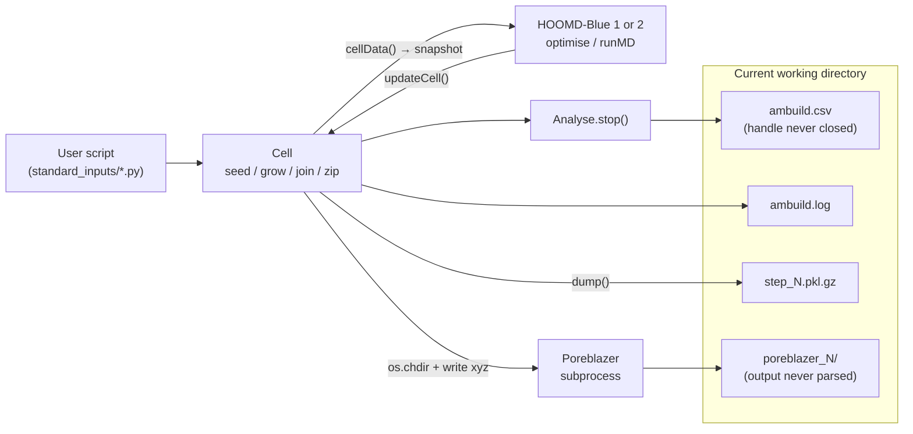
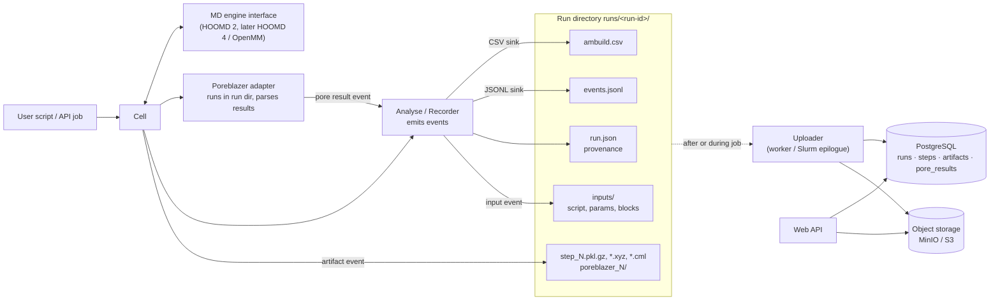

# Ambuild architecture

How a build runs today, where it is heading, and the order the changes land in.
Roadmap items referenced here are in [`../TODO.md`](../TODO.md) §5 and §6.

## Current workflow

A user script drives a single `Cell` object. Every step is a `Cell` method;
external engines are called in-process (HOOMD-Blue) or as a subprocess
(Poreblazer), and all output lands in the current working directory.

Limitations this causes:

- Two runs cannot share a process or directory: output names are fixed and
  `Cell.poreblazer()` changes the process working directory.
- Poreblazer results (surface area, pore volume, pore diameters, PSD) are never
  read back, so they are missing from the CSV.
- The only machine-readable record is a CSV; everything else is pickles.

## Target workflow

The engine writes everything for a run into its own directory and emits events
through `Analyse`. It never talks to the network. A separate uploader, run by
the service worker or a Slurm epilogue, ships the run directory to storage.

Event types emitted by the recorder:

| Event | Emitted from | Payload |
| --- | --- | --- |
| `run_started` | `Cell` creation | run id |
| `input` | `Cell` creation, `libraryAddFragment` | kind, source, path in `inputs/`, size, sha256 |
| `step` | `Analyse.stop()` | the existing CSV fields |
| `artifact` | `dump()`, `write*()` | path, path relative to the run directory, kind, sha256, size |
| `pore_result` | `Cell.poreblazer()` | parsed Poreblazer metrics |
| `run_finished` | end of script / failure | status, error |

## Delivery plan

Each increment is a separate, reviewable change that leaves the tests green
and the existing scripts working. Later increments depend only on earlier ones.

| # | Increment | Done when | TODO |
| --- | --- | --- | --- |
| 1 | **Run context.** `Cell` takes an optional output directory; `Analyse` closes its CSV; `Cell.poreblazer()` uses `run_command(directory=...)` instead of `os.chdir`. Default behaviour unchanged. | ✅ Two cells in one process write to separate directories; no `os.chdir` in the package. Logging is still process-wide. | §5 |
| 2 | **Poreblazer results.** Parse Poreblazer output into a dict and return it from `Cell.poreblazer()`. | ✅ Parser tested against a stored sample output. | §5 |
| 3 | **Event emitter.** `Analyse` sends events to a list of sinks; the CSV writer becomes the default sink. | ✅ CSV output byte-identical to before (checked against `csv.DictWriter` over the step events). | §6 |
| 4 | **JSONL sink + provenance.** `run.json` and `events.jsonl` in the run directory. | ✅ A run can be reconstructed from its directory alone (`Cell(recordRun=True)`; tested by moving the directory and restoring from it). | §6 |
| 5 | **Uploader and schema.** Idempotent ingestion into PostgreSQL + object storage. | Re-uploading a run creates no duplicate rows. | §6, §3 |
| 6 | **MD engine interface**, drop HOOMD 1. | HOOMD 2 tests pass through the interface. | §5 |
| 7 | **Split `ab_cell.py`** and add non-pickle serialisation. | No public API change. | §5 |

Increments 1–4 are useful without any server; 5 lands alongside the service
work in TODO §3.
