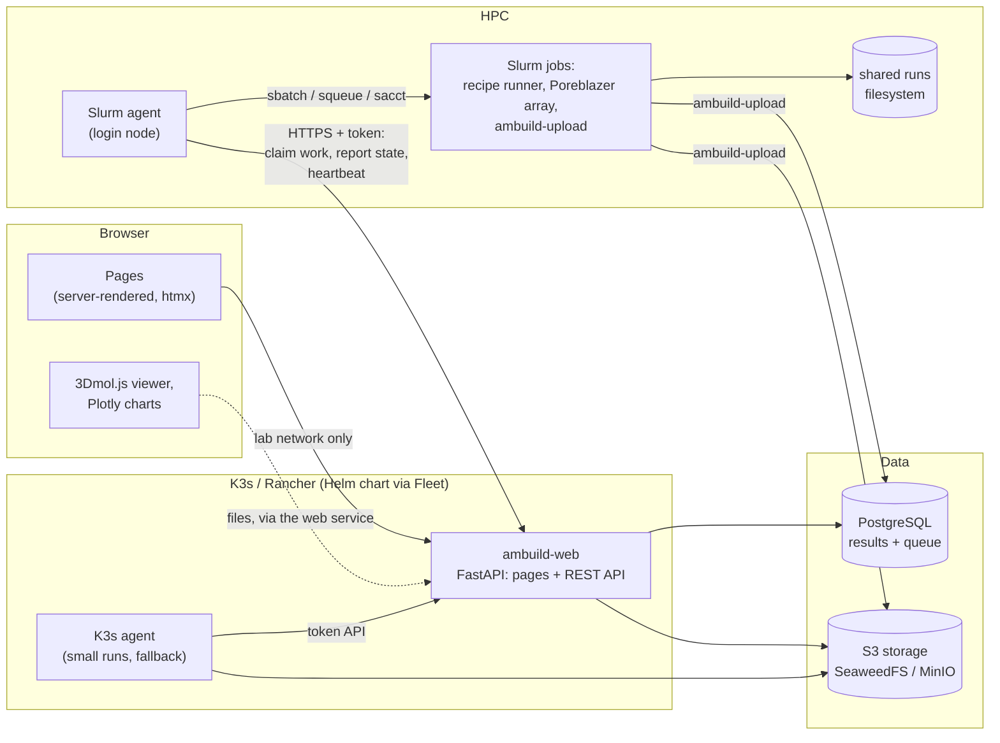
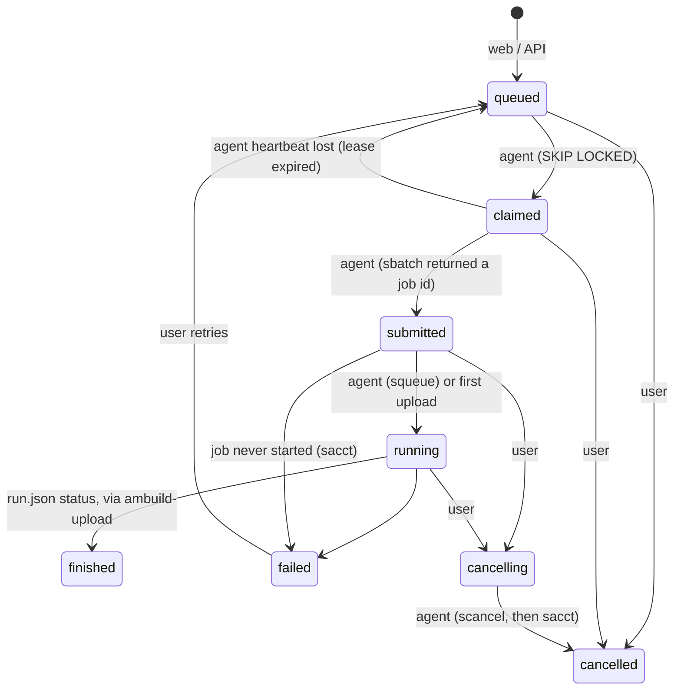

# Ambuild web GUI: plan

A web application for a lab's Ambuild work: queue builds singly or in batches, browse
stored runs, see the structures and Poreblazer results they produced, and check that
Slurm, the database and object storage are reachable. This is a plan, not an
implementation; the milestones at the end each ship something usable.

**Scope set by the decisions below:** an internal tool for about 20 users, on the lab
network only; no sign-in at first (local accounts later, then the lab's SSO); no quotas;
server-rendered pages with htmx, chosen for maintainability; the Slurm agent talks to the
web API with a token; a Docker Compose demo for testing, and a Helm chart deployed with
Rancher's GitOps (Fleet), kept well inside Fleet's and Helm's size limits.

## What exists already

The results side is in place (see [architecture.md](architecture.md)):

- **Runs are recorded** in self-contained directories (`run.json`, `events.jsonl`,
  `inputs/`, pickles, Poreblazer output), reproducible from a seed, replayable, and
  resumable from checkpoints with the same random sequence.
- **`ambuild-upload`** puts every run into PostgreSQL (`runs`, `events`, `steps`,
  `files`, `pore_results`) and object storage (SeaweedFS's S3 API; MinIO or any S3 works
  the same), idempotently, from Slurm jobs or an on-demand K3s scan.
- **Slurm submission** (`deploy/slurm/submit_build.sh`) runs a build script, uploads it,
  and optionally fans Poreblazer out over its checkpoints, sizing memory from the cell.

What is missing is everything in front of Slurm: a way to describe a build without a
Python script, a queue, something that hands queued work to Slurm, and the pages.

## Principles

1. **API first.** Every page is a view over a documented REST API (OpenAPI), so
   the same actions work from a Python client, the command line and the browser.
2. **No code from the browser.** Builds are submitted as *recipes* (declarative JSON,
   validated against a schema) plus uploaded building blocks and parameter files, never
   as Python scripts. The API never unpickles anything.
3. **The web tier never touches the cluster.** A small *Slurm agent* on a login node
   pulls work from the web API (with a token) and submits it (pull, not push): no inbound
   firewall rules to the cluster, no cluster credentials in the web application, and jobs
   already submitted keep running if the web tier is down.
4. **PostgreSQL is the queue.** Submissions are rows claimed with
   `SELECT … FOR UPDATE SKIP LOCKED`; no Redis or message broker to run.
5. **Reuse the existing pieces.** The runner is Ambuild itself; results arrive through
   `ambuild-upload`; files are streamed from object storage through the web service
   (the storage's address is internal to the cluster, so browsers cannot reach it).
6. **Maintainable over clever.** About 20 users need no caching layer, no worker pool
   and no front-end build: one Python service, one database, plain templates.
7. **Identity-ready without sign-in.** Every action already goes through one
   "current user" function, which today returns the name the user typed (kept in a
   cookie) and later returns the signed-in account, so adding accounts changes one
   function and adds a login page, not every endpoint.

## Architecture



- **ambuild-web** (new, `services/web`): FastAPI serving the REST API and server-rendered
  pages (Jinja templates, htmx for partial updates). JavaScript only where it earns its
  place: the structure viewer (3Dmol.js) and charts (Plotly). No front-end build chain,
  so Python developers can maintain it.
- **Slurm agent** (new, `services/agent`): a long-running process on a login node (a
  systemd user service or `tmux`; no root) that talks only to the web API, over HTTPS
  with a bearer token (one token per agent, stored hashed in the database, revocable on
  the settings page). It claims queued submissions, stages their
  inputs from S3 onto the shared filesystem, submits them with the existing sbatch
  scripts, polls `squeue`/`sacct` for state, uploads running runs incrementally for live
  progress, cancels on request, and writes a heartbeat with a cluster summary (`sinfo`).
- **K3s agent**: the same agent code with a Kubernetes backend (one Job per run), for
  small runs and when Slurm is unavailable. Also the local backend for development.
- **Recipe runner** (new, in the `ambuild` package): `python -m ambuild.recipe run
  recipe.json` executes a recipe step by step, recording the run, checkpointing after
  each stage and writing a viewable structure with each checkpoint.

## Recipes

A recipe is the unit of submission: what to build, from which inputs, with which
settings. It replaces the Python build script for web submissions (scripts stay
available on the command line).

```json
{
  "recipe_version": 1,
  "name": "PAF-like network",
  "cell": {"box": [30, 30, 30], "atom_margin": 0.5, "bond_margin": 0.5, "bond_angle_margin": 15},
  "fragments": [
    {"type": "A", "file": "sha256:3f1c…", "name": "ch4.car"},
    {"type": "B", "file": "sha256:9ab2…", "name": "benzene2.car"}
  ],
  "params": "sha256:77d0…",
  "bond_types": ["A:a-B:a", "B:a-B:a"],
  "stages": [
    {"op": "seed", "count": 10},
    {"repeat": 20, "stages": [
      {"op": "grow", "count": 5, "cell_end_groups": null, "max_tries": 50},
      {"op": "zip", "bond_margin": 1.0, "bond_angle_margin": 30},
      {"op": "optimise", "cycles": 10000}
    ]},
    {"op": "poreblazer", "settings": {"percolation_labelling": "poreblazer"}}
  ],
  "seed": 42,
  "resources": {"cpus": 2, "gpus": 0, "time": "02:00:00"}
}
```

- Operations map one-to-one onto `Cell` methods (`seed`, `grow`, `join`, `zip`,
  `optimise`, `md`, `delete_blocks`, `cap`, `poreblazer`, `dump`), each with a JSON
  schema for its arguments, so the form builder, the validator and the runner share one
  definition.
- Input files are referenced by sha256 and stored once in S3 (content-addressed), so
  resubmitting or sweeping never re-uploads them.
- The runner checkpoints after each top-level stage (and each repeat), writing the
  pickle, an extended XYZ with the cell lattice (for the viewer) and a `step` event.
- A recipe plus its inputs, seed and Ambuild version identifies a build exactly; that
  hash is the key for the checkpoint cache (milestone 6).

## Data model

New tables beside the existing results tables (the ingest schema stays as it is):

| Table | Holds |
| --- | --- |
| `users` | *later*: local accounts (then SSO identities); for now runs carry a free-text `owner` |
| `blobs` | content-addressed inputs: sha256, original name, kind (`car`, `params`), size, uploader |
| `recipes` | named, versioned recipe bodies (jsonb) with their sha256; who saved them |
| `sweeps` | a batch: recipe, parameter grid or seed list, name, owner, tags |
| `submissions` | the queue: recipe (+ overrides), seed, sweep, requested resources, backend, **state**, priority, owner, claiming agent, external job id, run id once known, attempts, error, timestamps |
| `agents` | each Slurm/K3s/local agent: host, backend, capabilities (partitions, GPUs), version, last heartbeat, cluster summary (jsonb), hashed API token |
| `run_notes` | tags, notes and stars users add to runs |
| `audit` | who did what (submit, cancel, delete, change settings), by owner name until accounts exist |

Submission states and who moves them:



Claims are leases: an agent that stops heart-beating loses its claimed (not yet
submitted) work back to the queue.

## Pages

### a. Submit and queue

- **New run**: pick a saved recipe or build one in a form generated from the operation
  schemas (stages as an editable list), upload or choose building blocks and parameter
  files, set seed (or "random": the recorded state makes it replayable either way),
  resources and backend. Before submitting: schema validation, a memory estimate
  (`ab_poreblazer.memory_estimate_mb`) and a run-time estimate from similar past runs.
- **Batch / sweep**: one recipe over N seeds, a parameter grid (e.g. box size ×
  fragment ratio × bond margin), or rows of an uploaded CSV. Shows the number of runs
  and total estimated core-hours before submitting; becomes one Slurm array per sweep.
- **Queue**: everyone's queued, submitted and running work, filterable by owner, sweep
  and state; live state from the agents; cancel, retry, reprioritise; the Slurm job id
  links to the job's log tail.
- **Run again**: from any run, resubmit with the same seed (reproduce), a new seed, or
  edited settings (fork). Resume a failed or time-limited run from its last checkpoint.

### b. Stored runs

- **Runs list**: every run in the database, filterable by status, owner, recipe, sweep,
  tag, date and any result (e.g. surface area > 2000 m²/g); columns chosen by the user;
  saved searches.
- **Run page**: status and provenance (`run.json`: versions, host, Slurm job, seed,
  inputs with hashes); steps table and charts (particles, blocks, density, free end
  groups, energy against step); the event log; files with download links; parent and
  child runs (Poreblazer tasks, resumes) as a lineage tree; notes and tags.
- **Compare**: two or more runs side by side: settings diff, step curves overlaid,
  Poreblazer results in one table, PSDs overlaid.
- **Sweep page**: the sweep's runs as a table and scatter plots of any result against
  any swept parameter (e.g. pore limiting diameter against box size, coloured by seed).

### c. Connectivity and settings

- **Status**: one card per dependency, green/amber/red with the reason:
  - PostgreSQL: reachable, schema version, row counts, size.
  - Object storage: bucket reachable, a write-read-delete probe, space used.
  - Each agent: last heartbeat, backend, version, what it can run, its cluster summary
    (partitions, idle/allocated nodes from `sinfo`), queue depth, last error.
  - Ingest: runs finished but not uploaded (from the agents' view of the runs directory).
- **Settings**: backends enabled, default resources and partitions per backend,
  agent tokens (create, revoke), retention for pickles and Poreblazer grids. Shown with
  secrets redacted; secrets themselves live only in Kubernetes Secrets and the agent's
  environment file, never in the database.
- **Test buttons**: run the probes on demand; submit a tiny test recipe to a chosen
  backend and follow it through to an uploaded run.

### d. Structures and Poreblazer results

- **Structure viewer** (3Dmol.js, in the run page and full screen): the final structure
  and every checkpoint, with a step slider; periodic box drawn; colour by element,
  fragment type or block; hide/show fragment types; measure distances; screenshot.
  Loads the extended XYZ files from object storage through the web service, never a
  pickle. Large cells (~10,000+ atoms) fall back to NGL or to line rendering.
  *Built in milestone 2:* `Cell.dump()` writes `step_N.xyz` next to each pickle
  (extended XYZ: `Lattice`, `pbc`, `step`, and per atom the species, position wrapped
  into the cell, fragment type and block id; ASE reads it). Runs recorded before that
  fall back to their `writeXyz` output. Above 10,000 atoms the viewer draws lines.
  View options can go in the address (`?colour=fragment&style=sphere`). Measuring
  distances is not built yet.
- **Poreblazer panel**: the 14 results with units; PSD and cumulative PSD plots; the
  settings used (grid, labelling, threads) and the Poreblazer version; results over the
  checkpoints of one build (how porosity develops as it grows).
- **Across runs**: scatter/histogram of any Poreblazer result over a filtered set of
  runs; PSD overlays; export as CSV.
- **Later**: the nitrogen-accessible grid as an isosurface in the viewer (the `.grd`
  files are large; generate a downsampled mesh in the Poreblazer task when asked).

## Other features, in scope

- **Sign-in, in stages**: none at first (an internal tool on the lab network; the
  ingress must not be exposed beyond it; users type a name, kept in a cookie, that is
  recorded as the owner). Next, local accounts (hashed passwords, sessions) and roles
  (viewer, submitter, admin), mapping existing owner names to accounts. Then the lab's
  SSO (OIDC), linking accounts by email. The "current user" function (principle 7) is
  the only seam.
- **Live progress**: while a run is running, the agent uploads it every minute or so
  (`ambuild-upload` is idempotent), so the run page's charts and viewer update live.
- **Checkpoint cache** (milestone 6): when a submitted recipe shares a prefix, seed,
  inputs and Ambuild version with an earlier run, start from that run's checkpoint;
  the queue shows "resumed from cache". Builds are reproducible from a seed, so a hit
  is the same answer, not just a similar sample.
- **Ordering**: the agent submits in priority then age order (no quotas; Slurm's fair
  share applies on the cluster).
- **Notifications**: email (or a Teams/Slack webhook) when a sweep finishes or a run
  fails.
- **Export**: download a run as a zip (the run directory as uploaded), a sweep's results
  as CSV, a structure as `.car`/`.cml`/`.xyz`.
- **Retention**: delete pickles and grids of old runs while keeping results and final
  structures (TODO §7); the settings page shows what a policy would free.
- **Python client**: `ambuild.client` (thin wrapper over the REST API) to submit, poll and
  download from notebooks.
- **Observability**: `/healthz` and `/readyz`, structured JSON logs, Prometheus metrics
  (queue depth, submissions per state, agent heartbeats, upload lag).

## Out of scope, for now

- Editing or running Python build scripts from the browser.
- Scheduling beyond Slurm's own (no custom node packing until the dispatcher work in
  TODO §8 shows it is needed).
- Sign-in, accounts and roles (staged, above), and quotas.
- Multi-tenant isolation (one lab, one deployment; every user sees every run).
- Real-time collaborative editing of recipes.

## Deployment

### Docker Compose demo (testing)

`deploy/docker-compose.yml` gains a `web` profile: PostgreSQL, SeaweedFS, the ingest
schema, `ambuild-web`, a local agent (runs recipes in a container), and a seeded demo
dataset (a few recorded runs with Poreblazer results), so `docker compose --profile web
up` gives a working GUI on a laptop. The existing `slurm-test` container gains the Slurm
agent, so CI tests the whole path: browser API → queue → agent → Slurm → upload → run page.

### Helm chart through Rancher GitOps (production)

`deploy/helm/ambuild/`: Deployments for `ambuild-web` and the K3s agent, a Service, an
Ingress (lab network only), a ConfigMap, a Secret reference, a PVC for the shared runs
volume, and a migration Job (the schema, applied idempotently, as the ingest does now).
PostgreSQL and S3 are *external*: the chart takes their connection details as values
(the lab's existing ones, or the upstream charts deployed separately), so it vendors no
subcharts. Fleet deploys it from a `fleet.yaml` next to the chart.

**Size limits.** Fleet stores each bundle as Kubernetes objects in etcd, and Helm stores
each release (the whole chart, gzipped, plus values) in a Secret; both are capped at
about 1 MiB, and a bundle over the limit fails to deploy, often without a clear error.
So:

- the chart holds templates and a short `values.yaml` only: no vendored subcharts, no
  embedded files (dashboards, SQL dumps, web assets), no binary data; the schema and the
  static web assets ship in the images, not the chart;
- the chart lives in its own directory, holding nothing else, because Fleet bundles
  everything under a GitRepo path; a `.helmignore` and a `.fleetignore` keep stray files
  out;
- CI enforces a budget: the packaged chart under 64 KiB and `helm template` output
  under 256 KiB (a quarter of the limit), and fails with the sizes if either grows past it;
- one chart for the application only; anything large (monitoring, databases) is a
  separate Fleet bundle.

The front-end libraries (htmx, 3Dmol.js, and a charting library) are vendored into the
`ambuild-web` image with pinned versions and checksums, so the tool works without
internet access from the lab network. For charts, uPlot (~50 KB) or Plotly's basic
bundle (~1 MB) rather than full Plotly (~3.5 MB).

## REST API sketch

| Method and path | Purpose |
| --- | --- |
| `POST /api/blobs`, `GET /api/blobs`, `GET /api/blobs/{sha256}` | upload a building block or parameter file (returns its sha256; deduplicated), list them, read one |
| `GET /api/recipe-format` | the operations and their arguments |
| `GET /api/agents` | the agents, their heartbeats and work |
| `GET/POST /api/recipes`, `GET /api/recipes/{id}` | list, save and read recipes |
| `POST /api/recipes/validate` | validate a recipe, return estimates |
| `POST /api/submissions` | queue one run, or a sweep (`{"recipe": …, "sweep": {"seeds": […]} }`) |
| `GET /api/submissions?state=&owner=&sweep=` | the queue |
| `POST /api/submissions/{id}/cancel`, `/retry` | cancel, retry |
| `GET /api/runs?…` | search runs by status, owner, recipe, tag and result ranges |
| `GET /api/runs/{id}` | run with provenance, steps, Poreblazer results, lineage |
| `GET /api/runs/{id}/files/{path}` | the file, streamed from object storage (only files the run recorded) |
| `GET /api/runs/{id}/structures` | the viewable structures, by step |
| `GET /api/sweeps/{id}` | a sweep and its runs' results |
| `GET /api/status` | the connectivity cards |
| `POST /api/agent/heartbeat`, `POST /api/agent/claim`, `PATCH /api/agent/submissions/{id}` | agent endpoints: bearer token, identifying the agent |

## Milestones

Each milestone is deployable on its own and has a check that says it is done.

| # | Milestone | Done when |
| --- | --- | --- |
| 0 ✅ | **Skeleton**: `services/web` (FastAPI, Jinja, htmx, vendored assets), config from the environment, `/healthz`, the owner-name cookie, **status page (c)** for PostgreSQL and S3; the Compose `web` profile with demo data; the Helm chart skeleton, its `fleet.yaml`, and the CI size budget | `docker compose --profile web up` shows both green, and red with the reason when either is stopped; `helm lint` passes and the size check reports the chart well under budget |
| 1 ✅ | **Run browser (b)** over the existing tables: list with filters, run page with provenance, steps charts, events, files streamed from storage, lineage, Poreblazer table and PSD plots (d, partly), compare two runs | every run uploaded by the Slurm end-to-end test is browsable, and downloads match their sha256 |
| 2 ✅ | **Structure viewer (d)**: `Cell.dump()` also writes an extended XYZ with the lattice; 3Dmol.js viewer with the step slider and colouring; Poreblazer results over checkpoints | the viewer shows every checkpoint of a recorded build; the XYZ round-trips to the same coordinates |
| 3 ✅ | **Recipes and the runner**: recipe schema and validation, `python -m ambuild.recipe run`, content-addressed blobs; queue tables; **submit (a)** one run to a **local/K3s agent** | a recipe submitted from the browser runs, uploads, and reproduces the structure of the same recipe run from the command line with the same seed |
| 4 | **Slurm agent**: token API for agents; claims, stages inputs, submits through the sbatch scripts, tracks state, cancels, heartbeats; agent cards and token management on the status page (c); live progress | a run queued in the browser runs on Slurm (the `slurm-test` container in CI) and its page updates while it runs; cancelling scancels it |
| 5 | **Batches and sweeps (a, b)**: seed lists, parameter grids, CSV; one array job per sweep; sweep page with scatter plots | a 3×3 grid sweep runs as one array, and its page plots a result against both parameters |
| 6 | **Checkpoint cache, resume and fork**: cache keyed by recipe prefix, seed, inputs and version; resume failed runs; run again / fork | resubmitting a finished recipe with the same seed starts from its final checkpoint and finishes in seconds with the same structure |
| 7 | **Hardening**: audit, notifications, retention, metrics, the Python client, the Helm chart deployed through Fleet to Rancher | the chart deploys from Git through Fleet; a sweep's owner gets an email when it finishes |
| 8 | **Accounts**: local accounts, sessions and roles; existing owner names mapped to accounts; then the lab's SSO (OIDC) | a user signs in locally; later, with SSO, the same user keeps their runs |

Milestones 0–2 need no queue and no changes to how builds run, so they deliver the run
and results browser early; 3–4 are the submission path; 5–7 build on it.

**As built in milestone 3.**

- **Recipes** (`ambuild/recipe.py`, the format above):
  - Operations: `seed`, `grow`, `join`, `zip`, `optimise`, `md`, `md_optimise`, `delete_blocks`, `cap` and `poreblazer`. Checkpoints are automatic, so there is no `dump` operation.
  - A fragment names its `.car` and `.csv` (and optional `.ambody`) files. `params: null` uses the parameter files of the installation doing the build.
  - The module imports only the standard library, so the web image installs it without NumPy.
  - A Poreblazer failure fails a recipe's run (a script carries on).
- **Queue tables** (`services/web/ambuild_web/schema.sql`): `blobs`, `recipes`, `agents` and `submissions`. They are created when the site starts using them, or by `ambuild-web init`.
  - `sweeps`, `run_notes` and `audit` come with the milestones that use them.
  - Each attempt at a submission is a new run id, so the run page links back to its submission.
- **New run page**:
  - a JSON editor with a Check button (validation, plus files never uploaded);
  - saved recipes, as versions of a name;
  - an upload list with Insert buttons for references;
  - the operations reference, generated from `ambuild.recipe.describe()`.

  A form built from the operation schemas is still to come.
- **Agents**:
  - Tokens are registered with `ambuild-web init --agent NAME:BACKEND[:TOKEN]`. The chart's init container does this from the Secret. Token management in the browser comes in milestone 4.
  - The heartbeat carries the submissions an agent still holds. Others it had started are marked failed, as lost when it restarted.
- **Local backend** (`services/agent`, image target `ambuild-agent`):
  - Runs each submission in its own container or pod, uploads it every minute while it runs, and again when it ends.
  - Cancelling sends SIGTERM; the runner records the run as failed ("Cancelled"), and it is uploaded.
  - The builds get no database or storage credentials.
  - A Kubernetes Job per run is deferred: the K3s agent is a Deployment that builds in its own pod, which is enough for small runs.
- **Check**: `docker compose --profile agent-test run agent-test` (CI job `agent`) does the following:
  - submits the demo recipe through the API, waits for it to finish, and checks the run and its Poreblazer result;
  - builds the same recipe from the command line and compares the final structure, which must be identical;
  - cancels a running MD build.

## Decisions

Made:

1. **Sign-in**: none for now (internal tool, lab network only); local accounts later,
   then SSO. The code keeps one "current user" seam so both are small changes.
2. **Quotas**: none.
3. **Agent access**: the web API with a per-agent bearer token; the agent never
   connects to PostgreSQL.
4. **Hosting**: a K3s service, deployed by a Helm chart through Rancher's GitOps (Fleet),
   within its size limits; a Docker Compose demo for testing.
5. **Front end**: server-rendered with htmx, for maintainability; sized for about 20 users.

Assumed, unless changed:

6. **Object storage**: SeaweedFS, as `deploy/` runs now (the application uses only the
   S3 API, so MinIO or another S3 works too).
7. **Visibility**: every user sees every run.
